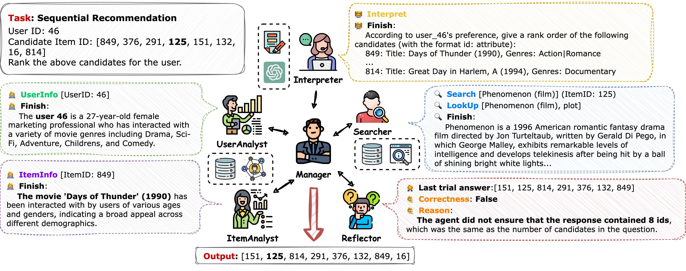

## MACRec: a Multi-Agent Collaboration Framework for Recommendation

This repository contains the official implementation of our SIGIR 2024 demo paper:
- [Wang, Zhefan, Yuanqing Yu, et al. "MACRec: A Multi-Agent Collaboration Framework for Recommendation". SIGIR 2024.](https://dl.acm.org/doi/abs/10.1145/3626772.3657669)

The video demo is available at [Video Demo](https://cloud.tsinghua.edu.cn/f/bb41245e81f744fcbd4c/?dl=1).

**A demo of using MACRec**:

https://github.com/wzf2000/MACRec/assets/27494406/0acb4718-5f07-41fd-a06b-d9fb36a7bb1b



### File structure

- `macrec/`: The source folder.
    - `agents/`: All agent classes are defined here.
        - `analyst.py`: The *Analyst* agent class.
        - `base.py`: The base agent class and base tool agent class.
        - `interpreter.py`: The *Task Interpreter* agent class.
        - `manager.py`: The *Manager* agent class.
        - `reflector.py`: The *Reflector* agent class.
        - `searcher.py`: The *Searcher* agent class.
    - `dataset/`: All dataset preprocessing methods.
    - `evaluation/`: The basic evaluation method, including the ranking metrics and the rating metrics.
    - `llms/`: The wrapper for LLMs (both API and open source LLMs).
    - `pages/`: The web demo pages are defined here.
    - `rl/`: The datasets and reward function for the RLHF are defined here.
    - `systems/`: The multi-agent system classes are defined here.
        - `base.py`: The base system class.
        - `collaboration.py`: The collaboration system class. **We recommend using this class for most of the tasks.**
        - `analyse.py`: ***(Deprecated)*** The system with a *Manager* and an *Analyst*. Do not support the `chat` task.
        - `chat.py`: ***(Deprecated)*** The system with a *Manager*, a *Searcher*, and a *Task Interpreter*. Only support the `chat` task.
        - `react.py`: ***(Deprecated)*** The system with a single *Manager*. Do not support the `chat` task.
        - `reflection.py`: ***(Deprecated)*** The system with a *Manager* and a *Reflector*. Do not support the `chat` task.
    - `tasks/`: For external function calls (e.g. main.py). **Note needs to be distinguished from recommended tasks.**
        - `base.py`: The base task class.
        - `calculate.py`: The task for calculating the metrics.
        - `chat.py`: The task for chatting with the `ChatSystem`.
        - **`evaluate.py`**: The task for evaluating the system on the rating prediction or sequence recommendation tasks. The task is inherited from `generation.py`.
        - `feedback.py`: The task for selecting the feedback for the *Reflector*. The task is inherited from `generation.py`.
        - `generation.py`: The basic task for generating the answers from a dataset.
        - `preprocess.py`: The task for preprocessing the dataset.
        - **`pure_generation.py`**: The task for generating the answers from a dataset without any evaluation. The task is inherited from `generation.py`.
        - `reward_update.py`: The task for calculating the reward function for the RLHF.
        - `rlhf.py`: The task for training the *Reflector* with the PPO algorithm.
        - `sample.py`: The task for sampling from the dataset.
        - `test.py`: The task for evaluating the system on few-shot data samples. The task is inherited from `evaluate.py`.
    - `utils/`: Some useful functions are defined here.
- `config/`: The config folder.
    - `api-config.json`: Used for Gemini API configuration. We give an example for the configuration, named `api-config-example.json`.
    - `agents/`: The configuration for each agent.
    - `prompts/`: All the prompts used in the experiments.
        - `agent_prompt/`: The prompts for each agent.
        - `data_prompt/`: The prompts used to prepare the input data for each task.
        - `manager_prompt/`: The prompts for the *Manager* in the `CollaborationSystem` with different configurations.
        - `old_system_prompt/`: ***(Deprecated)*** The prompts for other systems' agents.
        - `task_agent_prompt/`: ***(Deprecated)*** The task-specific prompts for agents in other systems.
    - `systems/`: The configuration for each system. Every system has a configuration folder.
    - `tools/`: The configuration for each tool.
    - `training/`: Some configuration for the PPO or other RL algorithms training.
- `ckpts/`: The checkpoint folder for PPO training.
- `data/`: The dataset folder which contains both the raw and preprocessed data.
- `log/`: The log folder.
- `run/`: The evaluation result folder.
- `scripts/`: Some useful scripts.

### Setup the environment

0. **Create and activate a conda environment with Python 3.10.13:**
    ```shell
    conda create -n macrec python=3.10.13
    conda activate macrec
    ```

1. **Install PyTorch (Note: change the URL setting if using another version of CUDA):**
    ```shell
    pip install torch --extra-index-url https://download.pytorch.org/whl/cu118
    ```

2. **Install project dependencies:**
    ```shell
    pip install -r requirements.txt
    ```

3. **Download and preprocess datasets:**

   **Quick setup (ml-100k, Amazon Beauty, and other datasets):**
   
   **On Windows:**
   ```shell
   scripts\preprocess.bat
   ```
   
   **On Unix/Linux/Mac:**
   ```shell
   bash ./scripts/preprocess.sh
   ```

   **Download specific Amazon datasets:**
   
   You can download and preprocess any Amazon category dataset using the following command:
   ```shell
   python main.py --main Preprocess --data_dir data --dataset amazon --amazon_category {dataset} --n_neg_items 7
   ```

   **Available Amazon Dataset Categories:**

   | Category | Command |
   |----------|---------|
   | Books | `python main.py --main Preprocess --data_dir data --dataset amazon --amazon_category Books --n_neg_items 7` |
   | Electronics | `python main.py --main Preprocess --data_dir data --dataset amazon --amazon_category Electronics --n_neg_items 7` |
   | Movies and TV | `python main.py --main Preprocess --data_dir data --dataset amazon --amazon_category "Movies_and_TV" --n_neg_items 7` |
   | CDs and Vinyl | `python main.py --main Preprocess --data_dir data --dataset amazon --amazon_category "CDs_and_Vinyl" --n_neg_items 7` |
   | Clothing, Shoes and Jewelry | `python main.py --main Preprocess --data_dir data --dataset amazon --amazon_category "Clothing_Shoes_and_Jewelry" --n_neg_items 7` |
   | Home and Kitchen | `python main.py --main Preprocess --data_dir data --dataset amazon --amazon_category "Home_and_Kitchen" --n_neg_items 7` |
   | Kindle Store | `python main.py --main Preprocess --data_dir data --dataset amazon --amazon_category "Kindle_Store" --n_neg_items 7` |
   | Sports and Outdoors | `python main.py --main Preprocess --data_dir data --dataset amazon --amazon_category "Sports_and_Outdoors" --n_neg_items 7` |
   | Cell Phones and Accessories | `python main.py --main Preprocess --data_dir data --dataset amazon --amazon_category "Cell_Phones_and_Accessories" --n_neg_items 7` |
   | Health and Personal Care | `python main.py --main Preprocess --data_dir data --dataset amazon --amazon_category "Health_and_Personal_Care" --n_neg_items 7` |
   | Toys and Games | `python main.py --main Preprocess --data_dir data --dataset amazon --amazon_category "Toys_and_Games" --n_neg_items 7` |
   | Video Games | `python main.py --main Preprocess --data_dir data --dataset amazon --amazon_category "Video_Games" --n_neg_items 7` |
   | Tools and Home Improvement | `python main.py --main Preprocess --data_dir data --dataset amazon --amazon_category "Tools_and_Home_Improvement" --n_neg_items 7` |
   | Beauty | `python main.py --main Preprocess --data_dir data --dataset amazon --amazon_category Beauty --n_neg_items 7` |
   | Apps for Android | `python main.py --main Preprocess --data_dir data --dataset amazon --amazon_category "Apps_for_Android" --n_neg_items 7` |
   | Office Products | `python main.py --main Preprocess --data_dir data --dataset amazon --amazon_category "Office_Products" --n_neg_items 7` |
   | Pet Supplies | `python main.py --main Preprocess --data_dir data --dataset amazon --amazon_category "Pet_Supplies" --n_neg_items 7` |
   | Automotive | `python main.py --main Preprocess --data_dir data --dataset amazon --amazon_category Automotive --n_neg_items 7` |
   | Grocery and Gourmet Food | `python main.py --main Preprocess --data_dir data --dataset amazon --amazon_category "Grocery_and_Gourmet_Food" --n_neg_items 7` |
   | Patio, Lawn and Garden | `python main.py --main Preprocess --data_dir data --dataset amazon --amazon_category "Patio_Lawn_and_Garden" --n_neg_items 7` |
   | Baby | `python main.py --main Preprocess --data_dir data --dataset amazon --amazon_category Baby --n_neg_items 7` |
   | Digital Music | `python main.py --main Preprocess --data_dir data --dataset amazon --amazon_category "Digital_Music" --n_neg_items 7` |
   | Musical Instruments | `python main.py --main Preprocess --data_dir data --dataset amazon --amazon_category "Musical_Instruments" --n_neg_items 7` |
   | Amazon Instant Video | `python main.py --main Preprocess --data_dir data --dataset amazon --amazon_category "Amazon_Instant_Video" --n_neg_items 7` |

   **Note:** Dataset downloads can take significant time (a few minutes to several hours) depending on the category size and your internet connection. The Books dataset, for example, is approximately 3GB and may take 20-30 minutes to download.

   **Yelp Academic Dataset:**
   
   The Yelp dataset requires manual download due to terms and conditions:
   
   1. Visit [Yelp Dataset Challenge](https://www.yelp.com/dataset)
   2. Agree to terms and download the dataset
   3. Extract JSON files to `data/Yelp/raw_data/`
   4. Process the dataset:
   ```shell
   python main.py --main Preprocess --data_dir data/Yelp --dataset yelp --n_neg_items 9
   ```

**Note:** We specifically test the code with Python 3.10.13. Other versions may not work as expected. Always activate the conda environment before running any commands:
```shell
conda activate macrec
```

### API Configuration

The project uses the Gemini API:

#### For Gemini API
Create or update `config/api-config.json`:
```json
{
    "provider": "gemini",
    "api_key": "your-gemini-api-key-here"
}
```

To use the Gemini API, the project is pre-configured with:

### Run with the command line

Use the following to run specific tasks:
```shell
python main.py -m $task_name --verbose $verbose $extra_args
```

Then `main.py` will run the `${task_name}Task` defined in `macrec/tasks/*.py`.

E.g., to evaluate the sequence recommendation task in MovieLens-100k dataset for the `CollaborationSystem` with *Reflector*, *Analyst*, and *Searcher* using Gemini API, just run:
```shell
python main.py --main Evaluate --data_file data/ml-100k/test.csv --system collaboration --system_config config/systems/collaboration/reflect_analyse_search.json --task sr
```

You can refer to the `scripts/` folder for some useful scripts.

### Run with the web demo

Use the following to run the web demo:
```shell
streamlit run web_demo.py
```

Then open the browser and visit `http://localhost:8501/` to use the web demo.

Please note that the systems utilizing open-source LLMs or other language models may require a significant amount of memory. These systems have been disabled on machines without CUDA support.

### Citation
If you find our work useful, please do not save your star and cite our work:
```
@inproceedings{wang2024macrec,
  title={MACRec: A Multi-Agent Collaboration Framework for Recommendation},
  author={Wang, Zhefan and Yu, Yuanqing and Zheng, Wendi and Ma, Weizhi and Zhang, Min},
  booktitle={Proceedings of the 47th International ACM SIGIR Conference on Research and Development in Information Retrieval},
  pages={2760--2764},
  year={2024}
}
```
